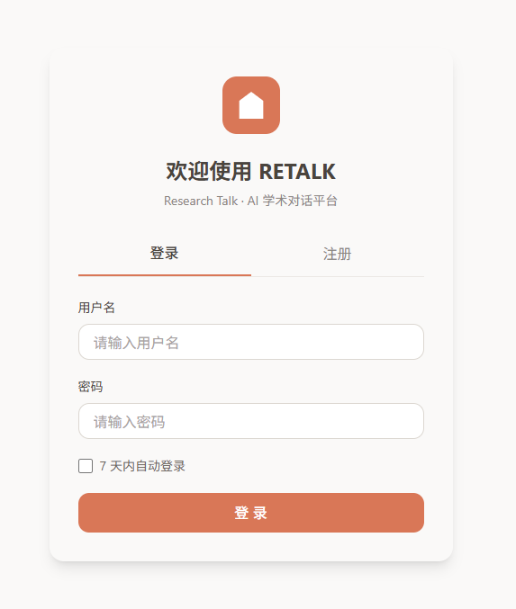
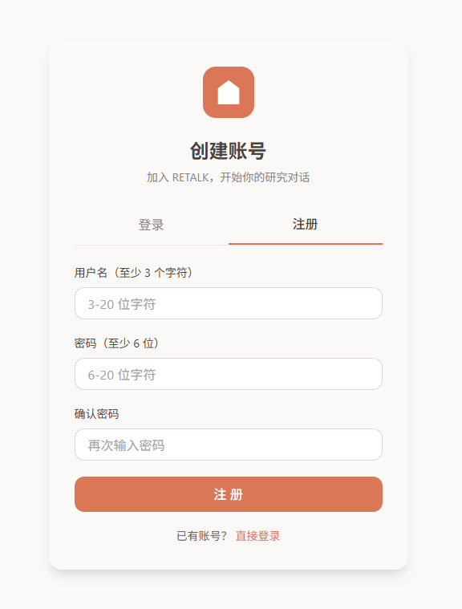
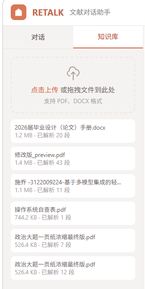
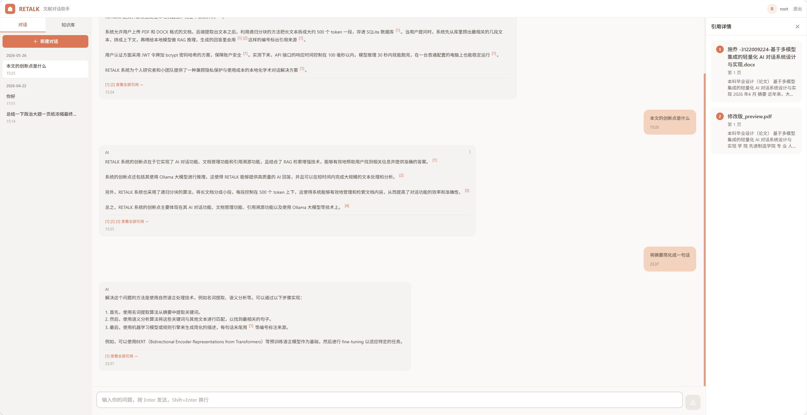
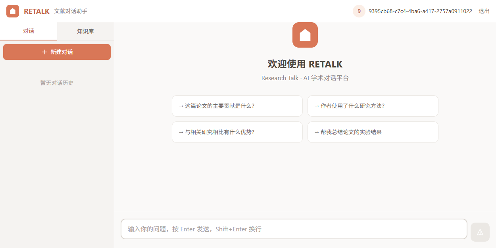
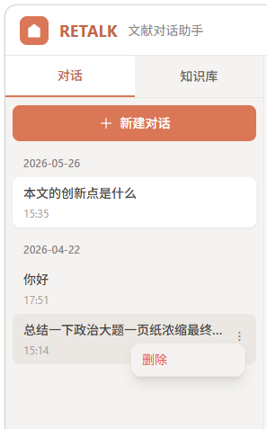

# RETALK — 本地 AI 学术研究对话平台

基于 **RAG（检索增强生成）** 架构的本地化 AI 对话平台。上传论文、报告等学术文档，AI 基于文档内容回答问题，**每句话标注引用来源**——所有数据与模型均在本地运行，无需联网。

<p align="center">
  
</p>

---

## 📸 界面预览

### 用户认证

| 登录 | 注册 |
|:---:|:---:|
|  |  |

### 主界面

| 知识库管理 | 对话页面 |
|:---:|:---:|
|  |  |

| 主页面概览 | 对话+侧边栏 |
|:---:|:---:|
|  |  |

---

## ✨ 核心功能

| 功能 | 说明 |
|------|------|
| 📄 **文档管理** | 上传 PDF / DOCX 文档，自动解析分块，支持查看和删除 |
| 💬 **RAG 对话** | 基于上传文档的语义检索 + LLM 生成，回答精准可溯源 |
| 📎 **引用标注** | AI 每句话末尾标注 `[1]` `[2]` 引用编号，点击即可查看原文出处 |
| 📤 **引用导出** | 支持将回答与引用导出为 PDF / Word / Markdown |
| 🔐 **用户认证** | 注册 / 登录，JWT 鉴权，对话与文档按用户隔离 |
| 🏠 **完全本地** | Ollama 本地模型 + SQLite 本地数据库，数据不出本机 |

---

## 🏗 系统架构

```
┌─────────────────────────────────────────────────┐
│                    Frontend                     │
│         React 18 + TypeScript + Vite            │
│         Tailwind CSS + TanStack Query           │
│         http://localhost:5173 (dev)             │
└──────────────────┬──────────────────────────────┘
                   │ HTTP REST API
┌──────────────────▼──────────────────────────────┐
│                   Backend                       │
│              FastAPI (Python 3.12)              │
│              http://localhost:8000              │
│                                                 │
│  ┌───────────┐  ┌──────────────┐  ┌─────────┐  │
│  │ API Layer │  │ RAG Pipeline │  │  Auth   │  │
│  │ /api/v1/  │  │ 检索→生成→引用 │  │  JWT    │  │
│  └───────────┘  └──────┬───────┘  └─────────┘  │
│                        │                        │
│  ┌─────────────────────▼──────────────────┐     │
│  │           Ollama Client                │     │
│  │   http://localhost:11434               │     │
│  └────────────────────────────────────────┘     │
│  ┌──────────────┐                               │
│  │   SQLite     │                               │
│  └──────────────┘                               │
└─────────────────────────────────────────────────┘
```

**RAG 流程：**

1. 用户上传文档 → PDF/DOCX 解析 → 文本分块（Chunk）→ 存入 SQLite
2. 用户提问 → 嵌入检索（关键词匹配）→ 召回最相关的 Top-K 片段
3. 构建 Prompt（系统指令 + 参考资料 + 用户问题）→ Ollama 生成回答
4. 解析回答中的 `[X]` 引用标记 → 映射回文档原文 → 一并返回前端

---

## 🛠 技术栈

| 层级 | 技术 |
|------|------|
| **前端框架** | React 18 + TypeScript + Vite |
| **样式方案** | Tailwind CSS |
| **状态管理** | TanStack React Query |
| **路由** | React Router DOM v6 |
| **HTTP 客户端** | Axios |
| **后端框架** | FastAPI (Python 3.12) |
| **ORM** | SQLAlchemy 2.0 (异步) |
| **数据库** | SQLite (aiosqlite) |
| **认证** | JWT + bcrypt |
| **文档解析** | PyPDF + python-docx |
| **大模型** | Ollama (默认 llama3.2) |
| **数据校验** | Pydantic v2 |
| **打包部署** | PyInstaller (可选) |

---

## 📁 项目结构

```
RETALK-本地AI对话网页实现/
├── backend/
│   ├── app/
│   │   ├── api/              # 路由层：auth / documents / conversations / citations
│   │   ├── core/             # 配置 / 数据库连接 / 异常定义
│   │   ├── models/           # ORM 模型：User / Document / Chunk / Conversation / Message
│   │   ├── schemas/          # Pydantic 请求/响应模型
│   │   ├── services/         # 核心业务逻辑
│   │   │   ├── pdf_parser.py        # PDF/DOCX 解析 + 分块
│   │   │   ├── embedding_service.py # 向量嵌入（可选）
│   │   │   ├── retrieval_service.py # 语义检索
│   │   │   ├── generation_service.py # RAG 回答生成 + 引用提取
│   │   │   └── export_service.py    # 引用导出
│   │   ├── auth.py           # JWT 认证工具
│   │   └── main.py           # FastAPI 应用工厂 + 启动入口
│   ├── dist/                 # 前端构建产物（打包时嵌入）
│   ├── uploads/              # 用户上传的文件
│   ├── run.py                # 打包后启动入口
│   ├── start.bat             # Windows 一键启动脚本
│   └── requirements.txt      # Python 依赖
├── frontend/
│   ├── src/
│   │   ├── components/
│   │   │   ├── auth/         # 登录/注册表单
│   │   │   ├── chat/         # 聊天区 / 消息气泡 / 输入框 / 欢迎页
│   │   │   ├── citation/     # 引用详情 / 导出面板
│   │   │   ├── layout/       # 布局：侧边栏 / 顶栏 / 引用面板
│   │   │   └── sidebar/      # 对话列表 / 文档列表 / 上传区
│   │   ├── hooks/            # 自定义 Hooks (auth, conversation, document, citation...)
│   │   ├── lib/              # API 客户端 / 工具函数
│   │   ├── types/            # TypeScript 类型定义
│   │   └── styles/           # 全局样式
│   ├── package.json
│   └── vite.config.ts
├── LICENSE                   # MIT License
└── README.md
```

---

## 🚀 快速开始

### 环境要求

- **Python** ≥ 3.10
- **Node.js** ≥ 18（仅开发模式需要）
- **[Ollama](https://ollama.com/)** 已安装并启动，已拉取所需模型

### 1. 安装 Ollama 并拉取模型

```bash
# 安装 Ollama → https://ollama.com/download
# 启动后拉取模型（以 llama3.2 为例）
ollama pull llama3.2:latest

# 验证 Ollama 是否正常运行
ollama list
```

### 2. 启动后端

```bash
cd backend

# 安装 Python 依赖
pip install -r requirements.txt

# 启动后端服务 (http://localhost:8000)
python -m uvicorn app.main:app --reload --host 127.0.0.1 --port 8000

# 或直接双击 Windows 启动脚本
start.bat
```

### 3. 启动前端（开发模式）

```bash
cd frontend

# 安装依赖
npm install

# 启动开发服务器 (http://localhost:5173)
npm run dev
```

### 4. 开始使用

1. 打开浏览器访问 `http://localhost:5173`（开发模式）或 `http://localhost:8000`（独立模式）
2. 注册账号并登录
3. 上传一篇 PDF 论文或 DOCX 文档
4. 新建对话，开始对文档内容提问
5. AI 回答每个要点都会标注引用来源，点击查看原文

### 独立部署（单个可执行文件）

```bash
cd backend
python build_exe.py --prebuilt-frontend
```

打包完成后，双击 `dist/retalk.exe` 即可启动（自动打开浏览器）。

---

## ⚙️ 配置说明

后端通过 `backend/.env` 文件配置，复制 `.env.example` 并修改：

| 配置项 | 说明 | 默认值 |
|--------|------|--------|
| `OLLAMA_BASE_URL` | Ollama API 地址 | `http://localhost:11434` |
| `OLLAMA_DEFAULT_MODEL` | 默认使用的模型 | `llama3.2:latest` |
| `OLLAMA_MODELS_PATH` | 模型文件本地路径 | `D:\Ollama\models` |
| `JWT_SECRET_KEY` | JWT 签名密钥 | 演示用固定值 |
| `DATABASE_URL` | 数据库连接地址 | `sqlite+aiosqlite:///./retalk.db` |
| `UPLOAD_DIR` | 文件上传目录 | `./uploads` |
| `MAX_FILE_SIZE_MB` | 上传文件大小限制 | `10` |

> **提示：** 如要使用其他模型（如 qwen3、deepseek-r1 等），修改 `OLLAMA_DEFAULT_MODEL` 为你已拉取的模型名即可。

---

## 🧪 API 端点概览

| 方法 | 路径 | 说明 |
|------|------|------|
| `POST` | `/api/v1/auth/register` | 用户注册 |
| `POST` | `/api/v1/auth/login` | 用户登录 |
| `GET` | `/api/v1/auth/me` | 获取当前用户 |
| `POST` | `/api/v1/documents/upload` | 上传文档 |
| `GET` | `/api/v1/documents/` | 获取文档列表 |
| `DELETE` | `/api/v1/documents/{id}` | 删除文档 |
| `POST` | `/api/v1/conversations` | 创建新对话 |
| `GET` | `/api/v1/conversations/` | 获取对话列表 |
| `DELETE` | `/api/v1/conversations/{id}` | 删除对话 |
| `GET` | `/api/v1/chat/{id}/messages` | 获取对话消息 |
| `POST` | `/api/v1/chat/{id}/send` | 发送消息（RAG 回答） |
| `POST` | `/api/v1/citations/export` | 导出引用（PDF/Word/MD） |
| `GET` | `/health` | 健康检查 |
| `GET` | `/api/config/ollama` | Ollama 配置信息 |

启动后端后访问 `http://localhost:8000/docs` 查看完整的 Swagger API 文档。

---

## 📄 许可

本项目采用 [MIT License](LICENSE)。

---

*Built with ❤️ 广东工业大学 · 毕业设计 · 施乔*
